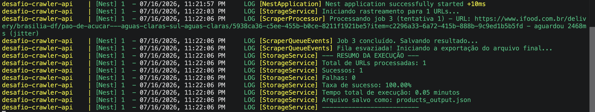

# Desafio Crawler Neogrid
Solução para o desafio técnico.
___
## Descrição da solução
A solução foi desenvolvida utilizando Node.js, o framework NestJS e a biblioteca Axios para realizar as requisições HTTP. 

Inicialmente, avaliei a utilização de ferramentas de simulação de navegador, como o Playwright. No entanto, o iFood emprega mecanismos avançados de proteção contra automação, como PerimeterX e Cloudflare, que dificultam a navegação automatizada. Na prática, a execução sequencial desse processo exigiria contornar desafios como CAPTCHAs e outros mecanismos de detecção de bots, tornando essa abordagem pouco viável e indo contra as especifições de não violação da página expostas no enunciado do teste.

Mesmo mantendo uma sessão autenticada por meio do Playwright, o dataset de referência tem produtos distribuídos em diversas localidades. Quando um produto pertence a uma região distante da localidade atualmente configurada na conta, a plataforma restringe o acesso ao produto. Automatizar esse processo implicaria mudanças frequentes de localidade de acordo com cada produto consultado, aumentando a complexidade da solução, a necessidade de intervenção humana e a probabilidade de falhas durante a execução.

Optei por fazer requisições direto na API iFood, utilizando os UUIDs dos produtos presentes no dataset, utilizando uma sessão válida, obtida de maneira manual na plataforma.

___

## Pré-requisitos
* Docker instalado na máquina 
* 500MB de armazenamento disponível para as imagens geradas
___

## Configuração

Copie o arquivo de exemplo:

```bash
cp .env.example .env
``` 
___

## Instalação 

```bash
docker compose up --build
```
___

## Execução 

O Swagger estará disponível no endpoint abaixo:

```
http://localhost:3000/docs
```

Os endpoints utilizam um chave enviada através do header:
```htpp
x-api-key: env-uuid-value
```

O Swagger dispõe uma criação de sessão, localizada no canto superior direito, com 
o nome **Authorize**.

No endpoint **/upload** são exigidos 2 arquivos, o **.xlsx** com as urls a serem buscadas 
e um **.txt** com o cURL gerado pela request da front do iFood na api. Ele pode ser obtido
pelo DevTools, filtre pela request que tem o UUID do produto como identificador e selecione
a opção de copiar com cURL. Como no exemplo da imagem abaixo:


O endpoint /resume é útil para os casos em que os cookies são inválidados pelo servidor e as 
requests começam a retornar 403. Nesse caso, uma lógica de Circuit Breaker é  acionada, onde os jobs são paralisados e podem ser retomados através desse endpoint com o envio de um novo cURL
em formato **.txt**.

A aplicação tem testes unitários implementados, para testar use na raiz projeto:
```bash
npm i
```

```bash
npm run test
```
___

## Exemplo de entrada
É esperado um arquivo .xlsx com o seguinte formato:

| url                     |
|-------------------------|
| https://ifood-sample1.url|
| https://ifood-sample2.url|
| https://ifood-sample3.url|
| https://ifood-sample3.url| 

___

## Exemplo de saída

```json
  {
    "title": "Desinfetante Sanitário Harpic Cloro Ativo 750ml",
    "normal_price": 19.99,
    "discount_price": null,
    "product_url": "https://www.ifood.com.br/delivery/campinas-sp/pao-de-acucar---campinas-souza-souzas/356eaf9b-8433-413a-a546-48d319ea69f8?item=ccabe6d7-b4bf-4a69-94cb-1d9ffd0482bd",
    "image_url": "https://static.ifood-static.com.br/image/upload/t_high/pratos/820af392-002c-47b1-bfae-d7ef31743c7f/202602131609_u11dm20nnq.png",
    "status": "success",
    "error_message": null
  },
```
A saída completa obtida no processamento do dataset pode ser visualizada no arquivo:
```bash
./resultados/products_output.json
```
___

## Estratégia do crawler

A solução tem como base o Axios para a execução das requests na API do iFood, reaproveitando uma sessão gerada via navegador, replicando os headers para se manter autenticado. O JSON da resposta é interceptado e explorado para a obtenção dos dados.

___

## Tratamento de erros

Durante o processamento, são tratados diferentes tipos de erro:

HTTP 403 (Forbidden): indica que a sessão utilizada nas requisições foi invalidada. Caso esses erros se repitam por 5 vezes, é acionado um Circuit Breaker para paralisar os jobs.
HTTP 404 (Not Found): ocorre quando a API retorna uma resposta sem informações do produto solicitado, indicando que o recurso não foi encontrado. 
Erro de negócio: ocorre durante a construção da URL do produto quando não é possível identificar os UUIDs necessários no endereço fornecido, impossibilitando a realização da consulta.

___

## Evidência de execução

___

## Taxa de sucesso obtida e tempo total de execução

___

## Melhorias futuras
* Persistir o estado do Circuit Breaker no redis, em vez de utilizar uma variável de instância.
* Observabilidade com Prometheus, com health-check dedicado, estado da fila (ativa/pausada) e integração com alertas via email, webhook ou Slack.
